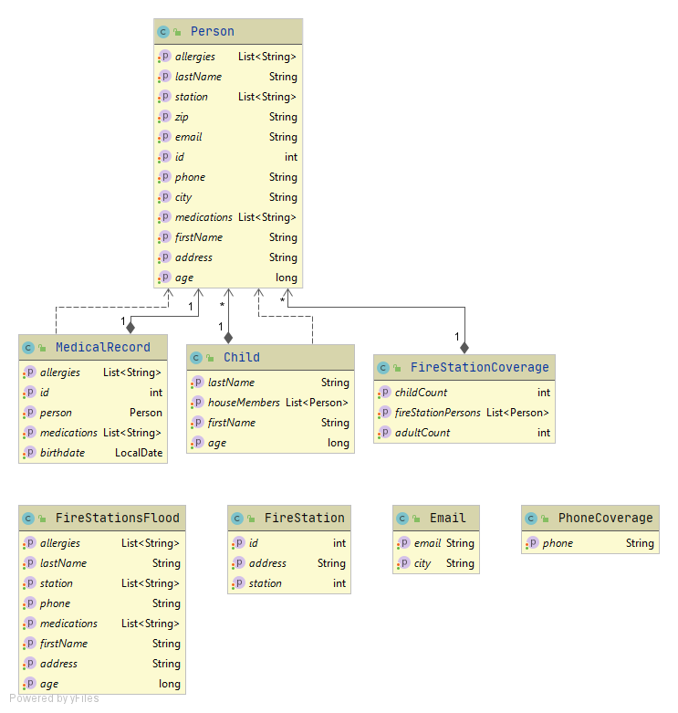

# OC : Parcours Java / Project 5 ( SafetyNet Alerts ) #

## Description

The objective of this project is to manage information about people, the medical history associated with these people, as well as fire stations for an emergency call center

## Configuration

This project using MySQL, it will have to be installed on the computer before running the application (https://dev.mysql.com/downloads/mysql/#downloads).
It will also be necessary to create a database named safetynet_alerts. The user is root and the password is rootroot. To modify this information, you can go to the application.properties file. A server must be functional for the application to run.

This application works under:

	- Java 11
	- Maven 3.0.0
	- Spring Boot 2.4.2
	
## Installation

	- Copy the project from Github
	- Install on your post
	- The server port is 8080
	- Go to the root of the application where pom.xml is available
	- Execute mvn spring-boot:run
	- You can test the save, delete and update functions using postman (https://www.postman.com/)
	- After having tested the different functions of the program using the localhost, you can run the tests using mvn clean test

## URLS
* GET : http://localhost:8080/person
	Return list of all persons
	
* GET : http://localhost:8080/firestations
	Return list of all stations
	
* GET : http://localhost:8080/medicalRecords
	Return list of all medical records
	
* GET : http://localhost:8080/firestation?stationNumber=
	Return list of all persons served by the station with count of child and adults
	
* GET : http://localhost:8080/childAlert?address=
	Return list of all child living at this address with all adults
	
* GET : http://localhost:8080/phoneAlert?firestation=
	Return list of all phones of persons by station location
	
* GET : http://localhost:8080/fire?address=
	Return list of all informations of persons living at this address with their served station
	
* GET : http://localhost:8080/flood/stations?stations= (List of stations number split by '/' ex : 1/2/3)
	Return list of all persons served by the station group by address
	
* GET : http://localhost:8080/personInfo?firstName=&lastName=
	Return list of all informations of persons by name
	
* GET : http://localhost:8080/communityEmail?city=
	Return list of all emails of persons by city

## ENDPOINTS

ACTUATOR (GET)

* INFO       : http://localhost:8080/actuator/info
* HEALTH     : http://localhost:8080/actuator/health
* METRICS    : http://localhost:8080/actuator/metrics	
* HTTP TRACE : http://localhost:8080/actuator/httptrace

## Data model

## Physical data model

